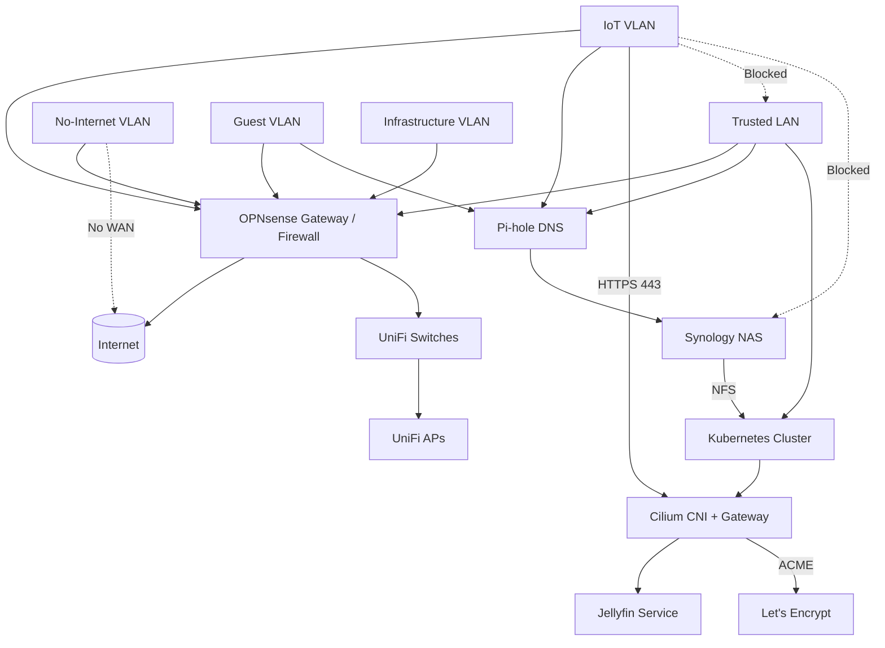

# Home Network Segmentation & Jellyfin Access Plan

> **Goal**: A segmented home network using OPNsense + UniFi + Kubernetes (Cilium) where Jellyfin is securely accessible to IoT (Roku) devices over HTTPS, while management and infrastructure services (e.g., UniFi) remain inaccessible to IoT.

---

## 1. High-Level Architecture

- **Gateway / Firewall**: OPNsense
- **Switching & Wi‑Fi**: UniFi switches and APs (self‑hosted UniFi controller)
- **DNS**: Pi‑hole (running on NAS)
- **Compute**: Kubernetes cluster with Cilium CNI + Gateway API
- **Media Service**: Jellyfin (running in Kubernetes)
- **Certificate Management**: cert‑manager + Let’s Encrypt

Key principle:
> **IP isolation first, TLS second** — certificates protect traffic, firewalling protects services.

---

## 2. Network Segments (Placeholders)

Replace the following placeholders with real values when implementing:

| Segment Name | Placeholder | CIDR Placeholder | Purpose |
|-------------|------------|------------------|---------|
| Trusted LAN | `<LAN_VLAN>` | `<LAN_CIDR>` | Personal devices, admin access |
| IoT | `<IOT_VLAN>` | `<IOT_CIDR>` | TVs, Roku, smart devices |
| No‑Internet | `<AIRGAP_VLAN>` | `<AIRGAP_CIDR>` | Devices with zero internet access |
| Guest | `<GUEST_VLAN>` | `<GUEST_CIDR>` | Guest devices |
| Work | `<WORK_VLAN>` | `<WORK_CIDR>` | Guest devices |
| Infrastructure | `<INFRA_VLAN>` | `<INFRA_CIDR>` | Router, switches, APs, monitoring |

---

## 3. Service Placement

### Jellyfin

- Runs inside Kubernetes
- Exposed via **Cilium Gateway**
- Assigned a **dedicated Gateway IP**: `<JELLYFIN_GW_IP>`
- HTTPS endpoint: `https://<JELLYFIN_FQDN>`

### UniFi Controller

- Runs on `<UNIFI_IP>`
- Accessible **only from Trusted LAN**
- Never shares IPs or gateways with Jellyfin

---

## 4. DNS Design (Pi‑hole)

Pi‑hole provides split‑horizon DNS and is enforced per VLAN.

### DNS Records

```text
<JELLYFIN_FQDN> → <JELLYFIN_GW_IP>
<UNIFI_FQDN>   → <UNIFI_IP>   (LAN only)
```

### Enforcement

- IoT VLAN DNS is forced to Pi‑hole
- Guest VLAN DNS is forced to Pi‑hole
- Optional: return NXDOMAIN for infra hostnames on IoT VLAN

---

## 5. Firewall Policy (Intent-Based)

### IoT VLAN (`<IOT_VLAN>`)

```text
ALLOW  <IOT_CIDR> → <JELLYFIN_GW_IP> : 443/tcp
ALLOW  <IOT_CIDR> → <PIHOLE_IP>      : 53/tcp,udp
ALLOW  <IOT_CIDR> → <NTP_IP>         : 123/udp
DENY   <IOT_CIDR> → <LAN_CIDR>       : any
DENY   <IOT_CIDR> → any              : default
```

### Trusted LAN (`<LAN_VLAN>`)

```text
ALLOW  <LAN_CIDR> → all VLANs        : admin‑initiated
```

### No‑Internet VLAN (`<AIRGAP_VLAN>`)

```text
DENY   <AIRGAP_CIDR> → WAN            : any
ALLOW  <LAN_CIDR>    → <AIRGAP_CIDR>  : admin‑only
```

---

## 6. mDNS / Discovery (Roku Requirement)

Roku devices require mDNS for Jellyfin discovery.

### Design

- mDNS **does not enter Kubernetes**
- OPNsense runs an mDNS reflector
- Reflection enabled only between:
  - `<LAN_VLAN>` ↔ `<IOT_VLAN>`

### Advertisement

- Advertise Jellyfin as:

```text
_jellyfin._tcp.local → <JELLYFIN_GW_IP>:443
```

UniFi settings:

- Disable "Block LAN to WLAN multicast" on IoT SSID
- Enable multicast enhancement (IGMP)
- Do not enable client isolation for IoT SSID

---

## 7. TLS & Certificates

### Certificate Strategy

- cert‑manager issues Let’s Encrypt certificates
- Preferred challenge: **DNS‑01**
- Alternative: HTTP‑01 (port 80 only on Jellyfin Gateway IP)

### Scope

- Certificates are issued **only** for `<JELLYFIN_FQDN>`
- UniFi and other services use separate IPs and certificates

> TLS protects Jellyfin traffic but does **not** expand network reachability.

---

## 8. Kubernetes / Cilium Notes

### Gateway

- Dedicated Gateway / GatewayClass for IoT‑exposed services
- Only Jellyfin routes are attached

### Network Policy (Placeholder)

```yaml
fromCIDR:
  - <IOT_CIDR>
toPorts:
  - port: "443"
    protocol: TCP
```

No Kubernetes service CIDRs are exposed directly to IoT.

---

## 9. Explicit Non‑Goals

- UniFi controller is **not** reachable from IoT
- Infrastructure services are **not** exposed via SNI‑only separation
- No shared IPs between unrelated services

---

## 10. Diagram-Friendly Variant (Mermaid)

The following diagram is intended for Markdown renderers that support Mermaid (e.g., GitHub, Obsidian, MkDocs).
It captures **network segmentation**, **service exposure**, and **storage relationships**.



---

## 11. Storage Design: NFS-backed Kubernetes StorageClass

- Synology NAS exports NFS from `<NAS_IP>`
- NFS is reachable **only** from:
  - Kubernetes node CIDR(s)
- NFS is **not** reachable from IoT, Guest, or WAN

### Intent

- Jellyfin media and metadata persist outside the cluster
- Storage survives node replacement
- NAS remains an infrastructure dependency, not an application endpoint

> The NAS is trusted infrastructure; access is explicit and one-directional.

---

## 12. Home Assistant & Matter (Kubernetes + IoT VLAN)

Home Assistant requires **L2 adjacency** with IoT devices to support:

- mDNS-based discovery
- Matter commissioning and operation
- IPv6 + multicast traffic

This is intentionally handled **inside Kubernetes** using Multus.

---

### 12.1 Design Overview

- Home Assistant runs as a Kubernetes workload
- The pod is **dual-homed**:
  - **Primary interface**: Cilium (cluster / LAN-facing)
  - **Secondary interface**: Multus attachment on IoT VLAN
- Home Assistant is treated as a **first-class IoT device**, not infrastructure

No other workloads are allowed L2 access to the IoT VLAN.

---

### 12.2 Multus Network Attachment (Placeholder)

> Static IPs are strongly recommended for Matter.

```yaml
apiVersion: k8s.cni.cncf.io/v1
kind: NetworkAttachmentDefinition
metadata:
  name: iot-net
spec:
  config: |
    {
      "cniVersion": "0.3.1",
      "type": "macvlan",
      "master": "<IOT_INTERFACE>",
      "mode": "bridge",
      "ipam": {
        "type": "static",
        "addresses": [
          {
            "address": "<HA_IOT_IP>/<IOT_PREFIX>",
            "gateway": "<IOT_GW>"
          }
        ]
      }
    }
```

---

### 12.3 Home Assistant Pod Annotation

```yaml
k8s.v1.cni.cncf.io/networks: iot-net
```

This annotation is **exclusive** to Home Assistant.

---

### 12.4 Routing & Hardening (Critical)

Home Assistant **must not** route traffic between interfaces.

Applied via initContainer or container entrypoint:

```bash
sysctl -w net.ipv4.ip_forward=0
sysctl -w net.ipv6.conf.all.forwarding=0
```

This ensures:

- Multi-homed ≠ router
- IoT VLAN cannot pivot into Kubernetes or LAN

---

### 12.5 Firewall Intent (IoT VLAN)

On OPNsense:

```text
ALLOW  <HA_IOT_IP> → <IOT_CIDR> : Matter, mDNS, required device protocols
DENY   <HA_IOT_IP> → <LAN_CIDR> : any
```

Home Assistant reaches LAN services **only** via its Cilium interface.

---

### 12.6 Kubernetes Network Policy (Optional but Recommended)

If enforcing Cilium policies:

```yaml
endpointSelector:
  matchLabels:
    app: home-assistant
egress:
- toCIDR:
  - <IOT_CIDR>
```

This prevents Home Assistant from becoming a lateral-movement pivot inside the cluster.

---

### 12.7 Matter-Specific Notes

Matter requires:

- Same L2 segment
- IPv6 enabled on IoT VLAN
- mDNS and multicast
- No NAT or L7 proxying

Implications:

- IPv6 Router Advertisements must reach the Multus interface
- mDNS reflectors are **not sufficient** for Matter
- Gateways and ingress controllers cannot replace L2 adjacency

---

## 13. Summary

- Segmentation is enforced at L3/L4 via OPNsense
- Jellyfin is the **only** IoT-reachable internal service via HTTPS
- Let’s Encrypt certificates do not weaken isolation
- mDNS is handled at the network edge (except where L2 is mandatory)
- Pi-hole runs on the Synology NAS and is authoritative DNS
- Synology NFS backs Kubernetes storage via a restricted StorageClass
- Home Assistant is **intentionally dual-homed** for Matter support
- Multus is scoped to a single workload with routing explicitly disabled

This design balances correctness, security, and operational reality without pretending Matter works at L3.
