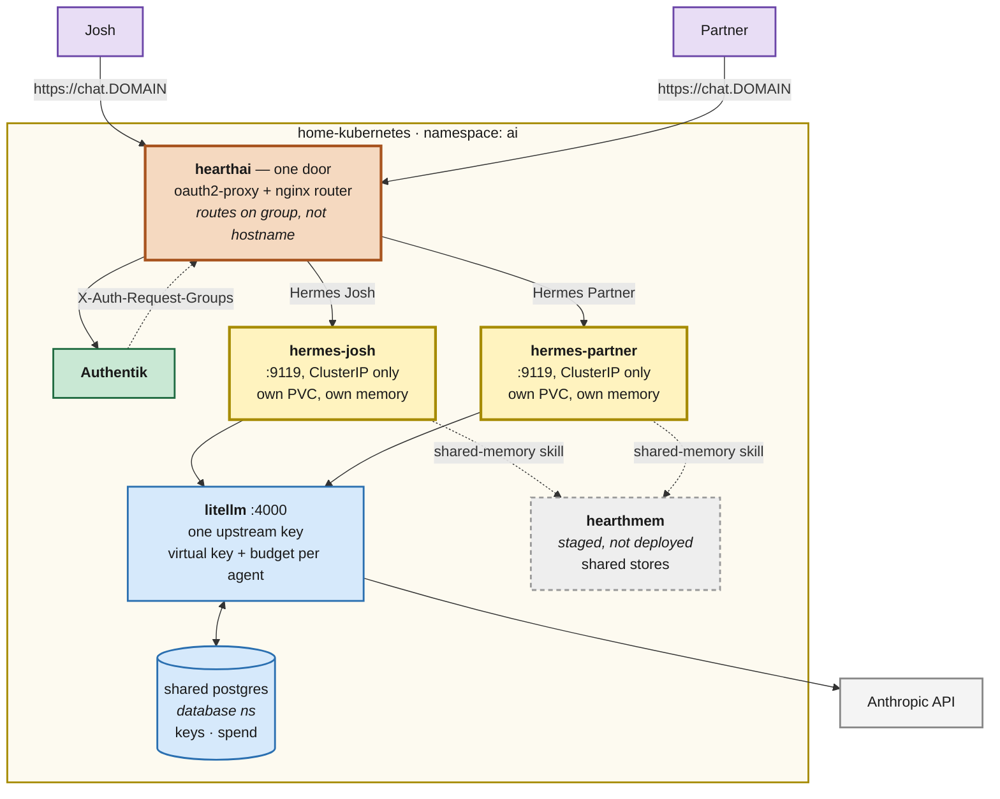

# Hermes household agents + hearthai shared memory

> Status: **PHASE 1 BUILT, NOT YET RECONCILED** · 2026-08-24 · Owner: Josh · Author: Claude
>
> First real implementation of the [`docs/ai-platform/`](../ai-platform/README.md) brainstorm.
> Two [Hermes](https://github.com/NousResearch/hermes-agent) agents — one for Josh, one for his
> partner — behind a self-hosted [LiteLLM](https://docs.litellm.ai) router, with the
> [hearthai](https://github.com/jokajak/hearthai) `shared-memory` skill plumbed in so the two
> agents can share what their people choose to share.

## Goal

Get a working household AI platform onto the cluster, shaped so that the parts we do not yet
understand (memory quality, proactivity, TELOS) can be learned from real use rather than
designed in advance.

The bet hearthai makes, which this deployment implements literally:

> The household layer does not need its own agent. Run an existing one per person — each with
> isolated memory, sessions, skills, and credentials — and everyone's private memory is private
> **by construction**, because it lives in a separate process on a separate home directory.
> What is missing between those agents is a way to share, and that is a skill.

So: **two containers, two PVCs, two identities.** Not one container with two profiles.

## Shape



## Decisions

### D1 — Two containers, not one container with two profiles

Upstream's Docker guide recommends **one container hosting many profiles**, because s6 supervises
each profile's gateway and you save an image, a venv, and a Playwright cache per profile. It also
lists the reasons to override that default, and one of them is exactly ours:

> **Compliance / blast radius** — distinct credentials never share an OS-level process tree.

Private-means-private is hearthai's first non-negotiable. A shared process tree makes that a
policy claim rather than a structural one. We pay two images' worth of disk to keep it structural.

### D2 — LiteLLM in front, Anthropic behind it

There is no GPU in this cluster — the nodes are Dell micro/SFF boxes and two Raspberry Pi 4s — so
in-cluster inference good enough to drive a tool-calling agent is not currently possible. Day one
is a hosted API either way. LiteLLM makes that a **routing decision instead of an identity**:

- The upstream `ANTHROPIC_API_KEY` exists **once**, inside LiteLLM. Neither agent ever holds it.
- Each agent authenticates with a **virtual key**, so per-person spend is attributable and
  budgetable, and revoking one person's access does not touch the other's.
- When local inference does become possible, it is a new entry in LiteLLM's `model_list`. Neither
  agent's manifest changes.

This is also what hearthai's own architecture calls for ("Inference engine — model access behind
one interface, so which model answers is a routing decision. LiteLLM probably.").

Models exposed on day one, all `chatgpt/*` upstream — a **ChatGPT subscription**, not a metered
API key. LiteLLM's first-party `chatgpt/` provider authenticates over OAuth device code and caches
the token, which is what makes **one subscription serve both agents**: LiteLLM holds the single
token, and each agent authenticates to LiteLLM with its own virtual key instead of holding a
credential of its own.

| Alias | Upstream | Role |
|---|---|---|
| `gpt-5.4` | `chatgpt/gpt-5.4` | main conversational model |
| `gpt-5.4-pro` | `chatgpt/gpt-5.4-pro` | deeper reasoning when it is worth the wait |
| `gpt-5.3-instant` | `chatgpt/gpt-5.3-instant` | auxiliary tasks (summarisation, compression, titles) |
| `gpt-5.3-codex` | `chatgpt/gpt-5.3-codex` | tool-heavy and code-shaped work |

Two constraints of that backend are load-bearing rather than incidental. It is native to the
**Responses API**, so each entry carries `model_info.mode: responses` and LiteLLM bridges Hermes'
Chat Completions onto it. And it **rejects** `max_tokens`, `max_output_tokens`,
`max_completion_tokens` and `metadata` — Hermes sends some of those, so `drop_params: true` is
required for requests to succeed at all, not just good hygiene.

### D3 — `nfs-csi` everywhere, so no pod is welded to a node

Hermes keeps its sessions, memory and search index in **SQLite**, whose default WAL mode needs
shared-memory mapping that NFS does not provide. The first cut took that at face value and put
agent state on `openebs-hostpath` — node-local disk — with VolSync shipping hourly restic
snapshots to MinIO for durability.

That got the trade backwards. `openebs-hostpath` is `WaitForFirstConsumer` with node affinity, so
the pod is pinned to whichever node first bound the claim, permanently. Losing that node does not
reschedule the agent; it means restoring from backup to get it back at all. On a five-node cluster
where two nodes are Raspberry Pis and LiteLLM is separately pinned to `amd64`, that is a lot of
rigidity bought for one filesystem feature.

Upstream sells the other side of the trade directly:

> Set this to `"delete"` explicitly for deployments whose backing filesystem is not WAL
> crash-safe, such as Linux containers bind-mounted through macOS virtiofs, **NFS**, or SMB.
> — Hermes' `cli-config.yaml.example`

So every volume in the namespace is `nfs-csi`, and the agents' seeded config sets
`database.journal_mode: "delete"`. DELETE journalling uses POSIX locks rather than shared memory.
The cost is WAL's concurrency and some of its crash-safety; for a single-writer personal agent
that is a modest price for a pod that can be rescheduled anywhere.

**The two settings are a pair.** `nfs-csi` with WAL still enabled risks database *corruption*,
not merely slowness — if any of these ever moves back to a node-local class, `journal_mode` has to
move back with it. Both files say so.

One ordering detail: Hermes "will not live-downgrade a database already open in WAL", so the
journal mode has to be correct before the first boot that creates `state.db`. Changing storage
class recreates the volume empty, which is precisely when that holds.

What this also retires: VolSync over `openebs-hostpath` was flagged as unproven here, because
`copyMethod: Direct` pins the mover to the node holding an RWO source while the cache PV cannot
follow. On `nfs-csi` that concern disappears — the component's own comment notes that `nfs-csi`
binds `Immediate` with no node affinity, so the mover schedules anywhere. The agents stay enrolled
in VolSync; the NAS is RAID 1, but a snapshot history off the NAS is still worth having.

Two small volumes hold only regenerable credentials — LiteLLM's ChatGPT OAuth token and
meridian's Claude login — and are `nfs-csi` for the same mobility reason, but are deliberately
**not** VolSync-enrolled: losing them costs a two-minute login, and replicating live credentials
to MinIO buys nothing.

### D4 — One door, routed by identity

No Telegram/Discord/Signal is available to this household, so Hermes' web dashboard is the
surface. It refuses to serve a non-loopback bind without an auth provider (fail-closed, after the
June 2026 campaign in which exposed dashboards were driven into planting SSH backdoors).

The first cut gave each agent its own hostname, with an Authentik application bound to a
single-member group deciding who could reach it. That worked, and it was boring — the boundary
was Authentik's, per host. It also meant every person had to know and type a hostname encoding
which agent was theirs, which is a strange thing to ask of a household.

So: **`chat.${SECRET_DOMAIN}` is the only hostname.** You log in once, and you land on your
own agent. Neither agent has an ingress any more; both are ClusterIP-only.

```
browser → ingress-nginx ──auth_request──→ oauth2-proxy ──OIDC──→ Authentik
              │                                │
              │←────── X-Auth-Request-Groups ──┘
              ↓
        hearthai-router (nginx)
              ├── "Hermes Josh"    → hermes-josh:9119
              ├── "Hermes Partner" → hermes-partner:9119
              └── neither          → 403
```

**Routing is on groups, not usernames**, for two reasons. The groups are already the access
boundary for these agents, so there is one source of truth rather than two that can drift. And
usernames are sensitive here — `users.sops.yaml` is encrypted precisely so they stay out of the
repo — whereas the group names are plain text in `application_hermes.tf` already.

#### The part that has to be right

**That header is the access boundary.** It replaces a per-hostname Authentik binding with a
string in a request, so a caller must never be able to supply their own. Two things enforce it,
and both are required:

1. **ingress-nginx sets the `X-Auth-Request-*` headers from the auth subrequest**, overwriting
   whatever the client sent. This is what `auth-response-headers` does.
2. **A CiliumNetworkPolicy** means nothing but the ingress controller can open a connection to
   the router at all. Without it, any pod in the cluster could talk to the router directly and
   name its own identity.

Delete either one and one household member can read the other's private memory by typing a
header. The router also fails closed: an unrecognised or absent group gets 403, never a default
backend.

Worth stating the trade honestly: two hostnames with Authentik bindings was the more robust
design, because the boundary was enforced by the IdP rather than by a header plus a network
policy. One door is materially nicer to live with and materially more delicate. That is a real
cost, accepted deliberately.

#### Two auth layers, one login

Both agents keep their own dashboard OIDC gate — it cannot be turned off on a non-loopback bind,
and they bind `0.0.0.0` because the router is in another pod. So a request authenticates twice:
once at oauth2-proxy, once at the dashboard. In practice the second is a silent redirect, because
Authentik already has the session.

Both agents now advertise the **same** `HERMES_DASHBOARD_PUBLIC_URL`, so both register the same
redirect URI. That is fine: they are separate OIDC clients, and the callback routes back to
whichever agent the caller's group maps to — identity is stable across the round-trip.

The sign-in flow lives on its **own un-gated Ingress** for `/oauth2`. ingress-nginx applies auth
annotations per-Ingress rather than per-path, so a gated `/oauth2` is an infinite redirect loop
back to itself.

### D5 — Config is seeded, not enforced

This repo's guiding principle is everything-as-code, and an agent that rewrites its own
configuration is in obvious tension with that. The tension is real and worth naming rather than
resolving badly in either direction:

- Mounting `config.yaml` read-only would break `/model`, `/tools`, and the agent's own
  self-configuration — the learning loop is the product.
- Letting the agent own config entirely means a rebuilt agent starts from nothing.

What we do: an init container **seeds `config.yaml` only if absent**, from a ConfigMap in this
repo. Bootstrap is code; evolution belongs to the agent; the PVC (and its VolSync snapshots) is
what carries that evolution forward. Secrets never go in that file — they arrive as environment
variables, which take precedence over the on-disk `.env`.

**This is a knowingly incomplete answer.** If the seeded config drifts far from what the agents
actually run on, that drift is invisible to Git. Revisit once we know what they change.

### D6 — The hearthai skill is vendored read-only at boot, not copied into the repo

An init container clones `jokajak/hearthai` into an `emptyDir`, which the agent mounts
**read-only** at `/opt/data/external-skills`, registered via `skills.external_dirs`. Upstream's
docs are explicit that external dirs are *not* a write-protection boundary unless the filesystem
makes them one — mounting read-only makes them one, and it means the agent's autonomous skill
curator cannot quietly rewrite the shared-memory contract.

Re-cloned on every restart, so the skill tracks hearthai `main` without vendoring a copy here that
would drift.

## What is deployed

| Path | What |
|---|---|
| `kubernetes/apps/ai/litellm/` | LiteLLM proxy. Its database is a role on the shared `database/postgres` cluster, not a cluster of its own — see [the consolidation plan](./2026-08-24-cnpg-consolidation.md). UI at `llm.${SECRET_DOMAIN}` |
| `kubernetes/apps/ai/hearthai/` | The door: oauth2-proxy + identity router + NetworkPolicy. `chat.${SECRET_DOMAIN}` |
| `kubernetes/apps/ai/hermes-josh/` | Josh's agent. ClusterIP only |
| `kubernetes/apps/ai/hermes-partner/` | Partner's agent. ClusterIP only |
| `kubernetes/apps/ai/meridian/` | Claude-subscription → Anthropic API bridge. **Inert until logged in** |
| `kubernetes/apps/ai/hearthmem/` | **Staged, not wired in** — see below |
| `terraform/authentik/application_hermes.tf` | Two OIDC applications + two single-member groups |
| `terraform/authentik/application_hearthai.tf` | The door's confidential OIDC client, bound to `users` |

### hearthmem is staged, deliberately

`ghcr.io/jokajak/hearthmem` **does not exist**. hearthai has `service/Dockerfile` but no CI to
publish it, so the manifests are written and reviewed but `kubernetes/apps/ai/kustomization.yaml`
does not reference `hearthmem/ks.yaml`. Wiring it in is a one-line change once an image is
published.

Until then the agents have the `shared-memory` skill and `HEARTHMEM_URL` pointing at a service
that is not there. The skill fails loudly when called rather than silently doing nothing, which is
the right failure: nothing is shared, and nobody believes it was.

## Owner steps

None of this can be done from a CI container — all of it needs credentials or a cluster.

**Order matters, and the agents will not start until steps 1–2 are done.** Both agents mount
their secrets with `envFrom`, and the dashboard fails closed without an auth provider, so until
the Bitwarden items and the Authentik applications exist the pods stay unready. That is the
intended failure: an agent that cannot verify who is talking to it should not serve.

### 1. Credentials

Most of these are **generated by `terraform/bitwarden`** — run `tofu apply` there and they appear.
Only the two that another party issues have to be entered by hand.

| Item | Fields | Created by | Used by |
|---|---|---|---|
| `litellm credentials` | `master_key`, `salt_key`, `ui_username`, `ui_password` | `tofu apply` | LiteLLM proxy + admin UI |
| `litellm pgcreds` | login: username + password | `tofu apply` | LiteLLM's role on the shared Postgres cluster |
| `hearthai credentials` | `cookie_secret` | `tofu apply` | Signs the door's session cookie |
| `authentik-client-hearthai` | login: id + secret | `tofu apply` (authentik) | oauth2-proxy's OIDC client |
| `hermes josh` | `litellm_api_key` | `tofu apply` seeds `replace-me`; you paste the value | Josh's agent → LiteLLM virtual key |
| `hermes partner` | `litellm_api_key` | `tofu apply` seeds `replace-me`; you paste the value | Partner's agent → LiteLLM virtual key |

`litellm_api_key` is minted by LiteLLM itself, so it cannot be generated ahead of time — and
that used to be a deadlock, because **external-secrets has no per-key "optional"**: one
unresolvable entry means the target Secret is never created, so an agent waiting on an unmintable
key could not start. Terraform now creates both items with a `replace-me` sentinel and never touches the
value again, so the whole platform reconciles from the first apply and the agents come up unable
to answer rather than unable to exist. Paste the real keys in whenever LiteLLM is up. They follow this repo's existing convention for
externally-issued secrets — hand-made in Bitwarden and only *read* by external-secrets, the same
as `maxmind api` and `vpn-gateway-secrets`. The full list lives in
[`terraform/bitwarden/README.md`](../../terraform/bitwarden/README.md#what-is-not-managed-here).

⚠️ **`salt_key` can never be rotated.** It encrypts provider credentials in LiteLLM's database, so
tainting `random_password.litellm_salt_key` makes every stored credential permanently unreadable.
It is generated once by Terraform and then left alone.

The two `litellm_api_key` values do not exist yet — LiteLLM mints them. Order of operations:
LiteLLM up → log into `llm.${SECRET_DOMAIN}` as `ui_username` → create a virtual key per agent
(suggest a monthly budget on each) → put each in its Bitwarden item → the agents pick them up on
the next `refreshInterval`.

### 2. Log LiteLLM into the ChatGPT subscription (one-time, interactive)

The `chatgpt/` provider mints its token through an OAuth **device code** flow, which is the one
thing here that cannot be declared in Git. Once the pod is running:

```sh
kubectl -n ai exec -it deploy/litellm -- litellm-proxy auth login   # prints a code + URL
```

Approve it in a browser on any device. The token lands in `CHATGPT_TOKEN_DIR=/token`, which is the
`litellm-token` PVC, so it survives restarts and reschedules. It is not enrolled in VolSync on
purpose — losing it costs another two-minute login, and replicating a live credential to MinIO
buys nothing.

⚠️ **One subscription, two people.** This is the arrangement that makes the household work on a
single plan, and it is also the part worth checking against OpenAI's terms before relying on it.

### 3. `tofu apply` in `terraform/authentik`

Creates the two OIDC applications, their Bitwarden client-id items, and the groups
`Hermes Josh` / `Hermes Partner`.

### 4. Add each person to their group

`terraform/authentik/users.sops.yaml` is encrypted and not readable from here, so this step is
yours: add `Hermes Josh` to Josh's `groups` list and `Hermes Partner` to the partner's. The group
names are already registered in `users.tf`'s `group_ids_by_name`.

**Membership is the whole access boundary.** Anyone in `Hermes Josh` can read everything Josh's
agent remembers.

### 5. Create the partner's Authentik user, if they do not have one

They need an account before they can be put in a group. Existing users log in through GitHub, so
their `email` must match their GitHub primary email.

## meridian, deployed but inert

`ghcr.io/rynfar/meridian` bridges the Claude Agent SDK to a standard Anthropic API endpoint — the
Claude-side twin of what LiteLLM's `chatgpt/` provider does for OpenAI. It is deployed and it
starts, but **the household has no Claude subscription, so it can do nothing yet**. It
authenticates by holding Claude Code credentials on its PVC; there is no key this repo can inject.

Two notes for when that changes. Log it in by getting a `~/.claude/.credentials.json` from a host
where `claude login` has run, and `kubectl cp` it onto the `meridian-auth` volume. And the point
of having it in-cluster is LiteLLM: add an `anthropic/` model whose `api_base` points at
`http://meridian.ai.svc.cluster.local:3456`, and both agents can reach Claude models through the
same router and the same virtual keys, without either holding a credential. That entry is
deliberately **not** in LiteLLM's config yet — a model that always 401s would be probed every
300s by background health checks.

Its image tags are worth a glance: the GHCR series (1.62.x) and the repo's git tags (v1.29.x) have
diverged. Renovate follows the registry, which is what actually ships.

## Deliberately not done

- **Messaging surfaces.** Nothing here is "reachable where you already are" yet — that was
  hearthai's second stated goal and it is unmet. Options when a platform exists: Matrix and
  Mattermost adapters are built in, as is a Home Assistant one, and HA is already on this cluster.
- **The TELOS engine.** `docs/ai-platform/00-telos.md` is still a skeleton. Nothing reads it.
  These agents have memory but no reconciliation loop.
- **Proactivity.** Both agents only respond. Hermes has a cron scheduler that could change that;
  hearthai's open question about what proactivity should be licensed by is unanswered, so it stays
  off.
- **LiteLLM UI via SSO.** The admin UI uses its own username/password rather than Authentik. It is
  internal-only and single-admin; wiring `GENERIC_*` OIDC env is a follow-up.
- **Per-agent egress policy.** Both agents can reach the internet as broadly as any pod here can.
  The new NetworkPolicy covers *ingress to the router* only — it is an access-control boundary,
  not an egress one.
  hearthai lists tool isolation and agent isolation as the two pieces that would make it safe to
  let an agent read the web and touch real services. Neither exists yet, in hearthai or here.

## Risks

| Risk | Why it matters | Mitigation |
|---|---|---|
| Node loss takes an agent's memory | Was the case on `openebs-hostpath`; this already happened once (#14) | Resolved by D3 — every volume is `nfs-csi`, so a lost node reschedules rather than restores. VolSync hourly → MinIO still runs for history |
| `LITELLM_SALT_KEY` lost or rotated | Every stored provider credential becomes unreadable | Bitwarden item, flagged above and in the ExternalSecret |
| Authentik group misassignment | One household member reads the other's private memory | Single-member groups, reviewed in Git |
| Identity header spoofed or router reached directly | Same: one member reads the other's memory | `auth-response-headers` makes ingress-nginx overwrite client-supplied values; CiliumNetworkPolicy admits only the ingress controller. **Both are required** — either alone is insufficient |
| A person in `users` but neither Hermes group | Authenticates at the door, then goes nowhere | Router returns 403 with a plain-language message rather than a default backend |
| Agent runs away with tokens | Unattended gateway loops cost real money | LiteLLM virtual-key budgets; `tool_loop_guardrails.hard_stop_enabled: true` in the seeded config, which upstream recommends for unattended deployments |
| Seeded config drifts from reality | Git stops describing what runs | Named in D5 as unresolved |
| VolSync over `openebs-hostpath` is unproven here | Every existing enrolled app backs up an `nfs-csi` claim; these are the first node-local sources | The shape should hold — `copyMethod: Direct` pins the mover to the node holding the RWO source, and the cache stays on `nfs-csi` so it follows — but **verify the first snapshot actually lands** rather than assuming it |
