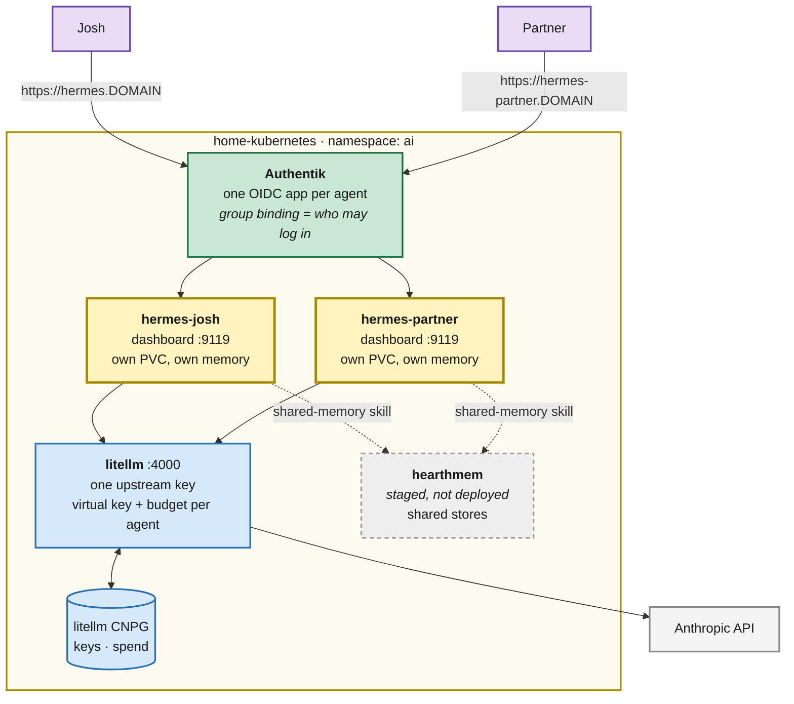

# Hermes household agents + hearthai shared memory

> Status: **PHASE 1 BUILT, NOT YET RECONCILED** · 2026-08-24 · Owner: Josh · Author: Claude
>
> First real implementation of the [`docs/ai-platform/`](../ai-platform/README.md) brainstorm.
> Two [Hermes](https://github.com/NousResearch/hermes-agent) agents — one for Josh, one for his
> partner — behind a self-hosted [LiteLLM](https://docs.litellm.ai) router, with the
> [hearthai](https://github.com/jokajak/hearthai) `shared-memory` skill plumbed in so the two
> agents can share what their people choose to share.

## Goal

Get a working household AI platform onto the cluster, shaped so that the parts we do not yet
understand (memory quality, proactivity, TELOS) can be learned from real use rather than
designed in advance.

The bet hearthai makes, which this deployment implements literally:

> The household layer does not need its own agent. Run an existing one per person — each with
> isolated memory, sessions, skills, and credentials — and everyone's private memory is private
> **by construction**, because it lives in a separate process on a separate home directory.
> What is missing between those agents is a way to share, and that is a skill.

So: **two containers, two PVCs, two identities.** Not one container with two profiles.

## Shape

## Decisions

### D1 — Two containers, not one container with two profiles

Upstream's Docker guide recommends **one container hosting many profiles**, because s6 supervises
each profile's gateway and you save an image, a venv, and a Playwright cache per profile. It also
lists the reasons to override that default, and one of them is exactly ours:

> **Compliance / blast radius** — distinct credentials never share an OS-level process tree.

Private-means-private is hearthai's first non-negotiable. A shared process tree makes that a
policy claim rather than a structural one. We pay two images' worth of disk to keep it structural.

### D2 — LiteLLM in front, Anthropic behind it

There is no GPU in this cluster — the nodes are Dell micro/SFF boxes and two Raspberry Pi 4s — so
in-cluster inference good enough to drive a tool-calling agent is not currently possible. Day one
is a hosted API either way. LiteLLM makes that a **routing decision instead of an identity**:

- The upstream `ANTHROPIC_API_KEY` exists **once**, inside LiteLLM. Neither agent ever holds it.
- Each agent authenticates with a **virtual key**, so per-person spend is attributable and
  budgetable, and revoking one person's access does not touch the other's.
- When local inference does become possible, it is a new entry in LiteLLM's `model_list`. Neither
  agent's manifest changes.

This is also what hearthai's own architecture calls for ("Inference engine — model access behind
one interface, so which model answers is a routing decision. LiteLLM probably.").

Models exposed on day one, all `anthropic/*` upstream:

| Alias | Upstream | Role |
|---|---|---|
| `claude-opus-5` | `anthropic/claude-opus-5` | main conversational model |
| `claude-sonnet-5` | `anthropic/claude-sonnet-5` | cheaper workhorse |
| `claude-haiku-4-5` | `anthropic/claude-haiku-4-5` | auxiliary tasks (summarisation, compression) |

### D3 — `openebs-hostpath` + VolSync, **never NFS**, for agent state

Hermes keeps its sessions, memory, and search index in **SQLite in WAL mode**
(`$HERMES_HOME/state.db`). WAL needs shared-memory mapping of the `-shm` file, which NFS does not
provide reliably — upstream's own config reference says as much, offering
`database.journal_mode: "delete"` as the escape hatch for "deployments whose backing filesystem is
not WAL crash-safe, such as ... NFS". Taking the escape hatch would mean giving up WAL's
concurrency and crash-safety to sit on a filesystem that is worse for this workload anyway.

So agent state lives on `openebs-hostpath` (node-local disk, WAL-safe). That is the same storage
class whose failure killed `ai/open-webui-data` when `basement-dell-sff`'s disk died
(`docs/ISSUES.md` #14) — **the difference is that these PVCs are enrolled in VolSync from the
first commit**, with hourly restic snapshots to MinIO. Node-local speed, off-node durability.

Consequence to accept: `openebs-hostpath` is `WaitForFirstConsumer` with node affinity, so each
agent pod is pinned to whichever node first schedules it. For a single-replica personal agent
that is fine; recovery from node loss is a VolSync restore, not a reschedule.

### D4 — The web dashboard is the surface, gated by Authentik

No Telegram/Discord/Signal is available to this household, so Hermes' built-in web dashboard is
the interaction surface. It refuses to serve a non-loopback bind without an auth provider
(fail-closed, after the June 2026 campaign where exposed dashboards were driven into planting SSH
backdoors), and it supports **self-hosted OIDC** with Authentik named explicitly.

Access control is Authentik's, not Hermes': **the dashboard verifies any ID token issued for its
`client_id`, so the thing that keeps Josh's agent Josh's is the Authentik application binding.**
Each agent gets its own OIDC application bound to its own single-member group. A public PKCE
client, no client secret.

Hostnames are flat — `hermes.${SECRET_DOMAIN}` and `hermes-partner.${SECRET_DOMAIN}` — because the
cluster's wildcard certificate is `*.${SECRET_DOMAIN}`, which is single-label. `partner.hermes.…`
would not be covered by it.

### D5 — Config is seeded, not enforced

This repo's guiding principle is everything-as-code, and an agent that rewrites its own
configuration is in obvious tension with that. The tension is real and worth naming rather than
resolving badly in either direction:

- Mounting `config.yaml` read-only would break `/model`, `/tools`, and the agent's own
  self-configuration — the learning loop is the product.
- Letting the agent own config entirely means a rebuilt agent starts from nothing.

What we do: an init container **seeds `config.yaml` only if absent**, from a ConfigMap in this
repo. Bootstrap is code; evolution belongs to the agent; the PVC (and its VolSync snapshots) is
what carries that evolution forward. Secrets never go in that file — they arrive as environment
variables, which take precedence over the on-disk `.env`.

**This is a knowingly incomplete answer.** If the seeded config drifts far from what the agents
actually run on, that drift is invisible to Git. Revisit once we know what they change.

### D6 — The hearthai skill is vendored read-only at boot, not copied into the repo

An init container clones `jokajak/hearthai` into an `emptyDir`, which the agent mounts
**read-only** at `/opt/data/external-skills`, registered via `skills.external_dirs`. Upstream's
docs are explicit that external dirs are *not* a write-protection boundary unless the filesystem
makes them one — mounting read-only makes them one, and it means the agent's autonomous skill
curator cannot quietly rewrite the shared-memory contract.

Re-cloned on every restart, so the skill tracks hearthai `main` without vendoring a copy here that
would drift.

## What is deployed

| Path | What |
|---|---|
| `kubernetes/apps/ai/litellm/` | LiteLLM proxy + CNPG Postgres (`litellm-database`) + barman/MinIO backups. UI at `llm.${SECRET_DOMAIN}` |
| `kubernetes/apps/ai/hermes-josh/` | Josh's agent. `hermes.${SECRET_DOMAIN}` |
| `kubernetes/apps/ai/hermes-partner/` | Partner's agent. `hermes-partner.${SECRET_DOMAIN}` |
| `kubernetes/apps/ai/hearthmem/` | **Staged, not wired in** — see below |
| `terraform/authentik/application_hermes.tf` | Two OIDC applications + two single-member groups |

### hearthmem is staged, deliberately

`ghcr.io/jokajak/hearthmem` **does not exist**. hearthai has `service/Dockerfile` but no CI to
publish it, so the manifests are written and reviewed but `kubernetes/apps/ai/kustomization.yaml`
does not reference `hearthmem/ks.yaml`. Wiring it in is a one-line change once an image is
published.

Until then the agents have the `shared-memory` skill and `HEARTHMEM_URL` pointing at a service
that is not there. The skill fails loudly when called rather than silently doing nothing, which is
the right failure: nothing is shared, and nobody believes it was.

## Owner steps

None of this can be done from a CI container — all of it needs credentials or a cluster.

**Order matters, and the agents will not start until steps 1–2 are done.** Both agents mount
their secrets with `envFrom`, and the dashboard fails closed without an auth provider, so until
the Bitwarden items and the Authentik applications exist the pods stay unready. That is the
intended failure: an agent that cannot verify who is talking to it should not serve.

### 1. Bitwarden items (before Flux reconciles)

| Item | Fields | Used by |
|---|---|---|
| `litellm credentials` | `master_key`, `salt_key`, `ui_username`, `ui_password` | LiteLLM proxy + admin UI |
| `anthropic api` | `api_key` | LiteLLM's only upstream credential |
| `hermes josh` | `litellm_api_key` | Josh's agent → LiteLLM virtual key |
| `hermes partner` | `litellm_api_key` | Partner's agent → LiteLLM virtual key |

⚠️ **`salt_key` can never be rotated.** It encrypts provider credentials in LiteLLM's database;
changing it makes every stored credential unreadable. Generate once
(`openssl rand -hex 32`), store it, do not regenerate.

The two `litellm_api_key` values do not exist yet — LiteLLM mints them. Order of operations:
LiteLLM up → log into `llm.${SECRET_DOMAIN}` as `ui_username` → create a virtual key per agent
(suggest a monthly budget on each) → put each in its Bitwarden item → the agents pick them up on
the next `refreshInterval`.

### 2. `tofu apply` in `terraform/authentik`

Creates the two OIDC applications, their Bitwarden client-id items, and the groups
`Hermes Josh` / `Hermes Partner`.

### 3. Add each person to their group

`terraform/authentik/users.sops.yaml` is encrypted and not readable from here, so this step is
yours: add `Hermes Josh` to Josh's `groups` list and `Hermes Partner` to the partner's. The group
names are already registered in `users.tf`'s `group_ids_by_name`.

**Membership is the whole access boundary.** Anyone in `Hermes Josh` can read everything Josh's
agent remembers.

### 4. Create the partner's Authentik user, if they do not have one

They need an account before they can be put in a group. Existing users log in through GitHub, so
their `email` must match their GitHub primary email.

## Deliberately not done

- **Messaging surfaces.** Nothing here is "reachable where you already are" yet — that was
  hearthai's second stated goal and it is unmet. Options when a platform exists: Matrix and
  Mattermost adapters are built in, as is a Home Assistant one, and HA is already on this cluster.
- **The TELOS engine.** `docs/ai-platform/00-telos.md` is still a skeleton. Nothing reads it.
  These agents have memory but no reconciliation loop.
- **Proactivity.** Both agents only respond. Hermes has a cron scheduler that could change that;
  hearthai's open question about what proactivity should be licensed by is unanswered, so it stays
  off.
- **LiteLLM UI via SSO.** The admin UI uses its own username/password rather than Authentik. It is
  internal-only and single-admin; wiring `GENERIC_*` OIDC env is a follow-up.
- **Per-agent egress policy.** Both agents can reach the internet as broadly as any pod here can.
  hearthai lists tool isolation and agent isolation as the two pieces that would make it safe to
  let an agent read the web and touch real services. Neither exists yet, in hearthai or here.

## Risks

| Risk | Why it matters | Mitigation |
|---|---|---|
| Node loss takes an agent's memory | `openebs-hostpath` is node-local; this already happened once (#14) | VolSync hourly → MinIO from day one; restore is documented in the VolSync plan |
| `LITELLM_SALT_KEY` lost or rotated | Every stored provider credential becomes unreadable | Bitwarden item, flagged above and in the ExternalSecret |
| Authentik group misassignment | One household member reads the other's private memory | Single-member groups; the binding is the boundary and is reviewed in Git |
| Agent runs away with tokens | Unattended gateway loops cost real money | LiteLLM virtual-key budgets; `tool_loop_guardrails.hard_stop_enabled: true` in the seeded config, which upstream recommends for unattended deployments |
| Seeded config drifts from reality | Git stops describing what runs | Named in D5 as unresolved |
| VolSync over `openebs-hostpath` is unproven here | Every existing enrolled app backs up an `nfs-csi` claim; these are the first node-local sources | The shape should hold — `copyMethod: Direct` pins the mover to the node holding the RWO source, and the cache stays on `nfs-csi` so it follows — but **verify the first snapshot actually lands** rather than assuming it |
