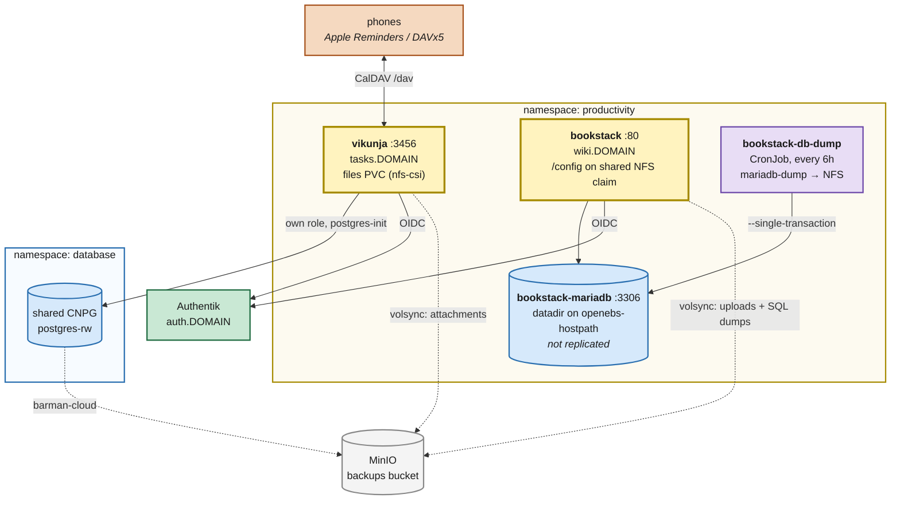

# Vikunja (tasks) and BookStack (wiki)

**Date:** 2026-09-07
**References:** <https://vikunja.io/docs/> · <https://www.bookstackapp.com/docs/>

---

## Context

The household has nowhere to keep a shared, dated checklist and nowhere to keep prose that
is not a scanned document. The immediate driver is trip preparation — a packing list that is
rebuilt from the same template every trip, alongside dated pre-trip tasks like renewing a
passport — but the gap is general.

Two apps, because these are two different shapes and one does not substitute for the other:

- **Vikunja** — the task manager. Projects, tasks, due dates, labels, assignees, and a CalDAV
  endpoint so each project appears as a list in the phones' native reminders apps. Project
  duplication is what makes a reusable packing-list template possible.
- **BookStack** — the wiki. Shelves → books → chapters → pages, for reference prose that
  outlives any one trip. Paperless already holds the scanned artifacts; this holds the writing
  about them.

Both land in the `productivity` namespace next to `mealie`, `paperless`, `wallos`, `forgejo`.

## Current State

- **Postgres**: one shared CNPG cluster at `postgres-rw.database.svc.cluster.local.`; apps get a
  database and an unprivileged role reconciled on every start by a `postgres-init` initContainer
  reading a Bitwarden-held credential (`paperless`, `forgejo`).
- **No MySQL/MariaDB anywhere.** `grep -ril 'mysql\|mariadb' kubernetes/apps` returns nothing.
- **Storage**: static `Retain` NFS PVs with per-app sentinel classes for large document trees;
  dynamic `nfs-csi` for ordinary app data; `openebs-hostpath` (node-local) for database datadirs.
- **Backups**: `kubernetes/components/volsync` (restic → MinIO `backups`) per PVC; barman-cloud →
  MinIO `databases` for CNPG. Nothing in the cluster backs up a non-CNPG database.
- **No SMTP.** Forgejo sets `ENABLE_NOTIFY_MAIL: false` with the comment "no SMTP anywhere in this
  cluster; fail closed rather than queue mail."
- **SSO**: `terraform/authentik/application_<app>.tf` + the `oidc_creds` module, which stores the
  client pair in Bitwarden as `authentik-client-<app>`.

## Target State

## Files Summary

| File | Purpose |
| --- | --- |
| `kubernetes/apps/productivity/vikunja/ks.yaml` | Flux Kustomization; volsync on `vikunja-files` |
| `…/vikunja/app/externalsecret.yaml` | pg role, JWT secret, and the OIDC `config.yml` |
| `…/vikunja/app/helmrelease.yaml` | app-template; `postgres-init` + `vikunja/vikunja` |
| `…/vikunja/app/kustomization.yaml` | wires the above + the guarded gatus template |
| `kubernetes/apps/productivity/bookstack/ks.yaml` | Flux Kustomization; volsync on `bookstack-data` |
| `…/bookstack/app/pvc.yaml` | one RWX `nfs-csi` claim: `config/` + `db-dumps/` |
| `…/bookstack/app/externalsecret.yaml` | MariaDB creds (server + app views), `APP_KEY`, OIDC pair |
| `…/bookstack/app/mariadb.yaml` | single MariaDB instance, datadir on `openebs-hostpath` |
| `…/bookstack/app/helmrelease.yaml` | app-template; `lscr.io/linuxserver/bookstack` |
| `…/bookstack/app/db-dump.yaml` | six-hourly `mariadb-dump` CronJob onto the NFS claim |
| `terraform/authentik/application_vikunja.tf` | OIDC provider + application + policy binding |
| `terraform/authentik/application_bookstack.tf` | OIDC provider + application + policy binding |

## Key Design Decisions

**D1 — BookStack brings a second database engine, and that is the whole cost of it.**
BookStack supports MySQL/MariaDB only; upstream has declined Postgres support because its
full-text search is MySQL-specific. So it cannot use the shared CNPG cluster and instead runs
a plain single MariaDB. Consequences accepted deliberately: a second engine to upgrade, a
second backup path (D2), and no operator to reconcile it. The alternative — Outline, which
would have reused Postgres, Dragonfly, MinIO and Authentik with no new engine — was considered
and rejected by the owner in favour of BookStack's simpler runtime.

**D2 — MariaDB is backed up logically, not by replicating its datadir.**
Pointing restic at a live InnoDB datadir gives a crash-consistent copy at best. Instead the
datadir sits on `openebs-hostpath` and is explicitly *not* enrolled in VolSync, while a CronJob
takes a `--single-transaction` dump onto the NAS claim every six hours. VolSync then ships that
claim — uploads and dumps together — to MinIO hourly. Worst case is losing up to six hours of
wiki edits; the restore is `gunzip | mariadb` into an empty instance, which works across
MariaDB versions in a way a datadir copy does not.

**D3 — One RWX claim for BookStack, split by subPath.**
`config/` for the app, `db-dumps/` for the CronJob, following the way paperless splits its
share. This keeps a single ReplicationSource covering the entire recovery story. It is
`ReadWriteMany` rather than the usual `ReadWriteOnce` because there really are two writers on
possibly different nodes; RWO would deadlock the CronJob behind the app pod.

**D4 — Vikunja's OIDC provider arrives as a file, not as env vars.**
Vikunja will not accept a provider that exists only in the environment — the provider key must
be present in a config file first, and env vars can then only override fields on an existing
one. Rather than split the config across a ConfigMap and a Secret, the whole `auth:` block is
templated inside the `vikunja-config` ExternalSecret and mounted at `/etc/vikunja/config.yml`,
the same way paperless assembles its allauth provider JSON. The client secret never lands in Git.

**D5 — Notifications go over CalDAV, not email.**
There is no SMTP in this cluster, so `VIKUNJA_MAILER_ENABLED` is false: no email reminders, no
password resets. Reminders reach the phones by subscribing to `/dav` from Apple Reminders or
DAVx5, where the OS handles the notification. This is also the better packing UX — ticking an
item is one tap, offline, standing in front of a drawer.

**D6 — BookStack runs as root, unlike everything else here.**
`lscr.io/linuxserver/bookstack` starts s6-overlay as root, fixes ownership on `/config`, and
drops to `PUID`/`PGID`. It cannot run with `runAsNonRoot`, so it keeps `CHOWN`, `DAC_OVERRIDE`,
`FOWNER`, `SETGID`, `SETUID` after dropping the rest. This is a real weakening of the pod
security posture relative to every other app in the namespace, accepted because it is the only
well-maintained BookStack image.

**D7 — BookStack has no local login at all.**
`AUTH_METHOD: oidc` with `AUTH_AUTO_INITIATE: true`. Without SMTP a local account could never
reset its own password, so a local fallback would be a liability rather than a safety net.
Break-glass is to set `AUTH_METHOD: standard` in Git and let Flux reconcile. Vikunja keeps
local auth enabled by contrast, because it is also the only way to hand out a plain CalDAV
password if the token flow misbehaves.

## Owner Steps

These cannot be done from the repo — they need secrets or an interactive session.

1. **Bitwarden items** (all in the terraform-managed collection):
   - `vikunja pgcreds` — login item. Username + password: the Postgres role for Vikunja.
   - `vikunja credentials` — custom field `service_secret`: a long random string (JWT signing
     key). Write-once; rotating it invalidates every session and CalDAV token.
   - `bookstack dbcreds` — login item. Username + password: the MariaDB app role. Custom field
     `root_password`: the MariaDB root password.
   - `bookstack credentials` — custom field `app_key`: a Laravel key, generated with
     `echo "base64:$(openssl rand -base64 32)"`. Write-once; rotating it invalidates sessions
     and anything BookStack stored encrypted.
2. **Apply the Authentik terraform** (`terraform/authentik`) to create both providers. The
   `oidc_creds` module writes `authentik-client-vikunja` and `authentik-client-bookstack` into
   Bitwarden itself; the ExternalSecrets read them from there.
3. **First login to BookStack becomes the admin.** Assign roles in Settings → Roles afterwards.
   Leave "require email confirmation" off — there is no SMTP to confirm through.
4. **Build the packing template in Vikunja**: a project named e.g. `Packing — Template`, items
   as tasks, categories as labels. Duplicate it per trip from the project's ⋯ menu.
5. **Connect the phones**: Vikunja user settings → CalDAV tab → generate a token (OIDC accounts
   have no password to use), then point Apple Reminders / DAVx5 at
   `https://tasks.${SECRET_DOMAIN}/dav/principals/<username>/`.

## Verification

- `flate test all -p kubernetes/flux/config` passes (this is what CI runs).
- After reconcile: both Kustomizations Ready; `vikunja` and `bookstack` Deployments Available;
  `bookstack-mariadb` passes its `healthcheck.sh --connect --innodb_initialized` probe.
- `https://tasks.${SECRET_DOMAIN}` and `https://wiki.${SECRET_DOMAIN}` both redirect to Authentik
  and land back logged in. Gatus shows both green.
- Confirm the second household member can sign in to Vikunja — registration is disabled, so
  verify that an OIDC login still provisions their account rather than being refused.
- After the first six-hourly tick, a `bookstack-*.sql.gz` exists under `db-dumps/` on the claim,
  and the next VolSync run includes it.

## Risks

- **NFS root_squash vs. the linuxserver image.** s6 chowns `/config` as root on every start. If
  the NAS export squashes root, that chown fails. Paperless writes to the same NAS as uid 1000
  without trouble, but it never chowns as root. If BookStack crashloops on first start, this is
  the first thing to check.
- **MariaDB credentials are create-once.** The official image reads `MARIADB_*` only on an empty
  datadir. Unlike `postgres-init`, rotating the password in Bitwarden does **not** rotate it in
  MariaDB — that is a manual `ALTER USER`, followed by letting ESO refresh the Secret.
- **The MariaDB pod is welded to one node** by its `openebs-hostpath` PV. Losing that node means
  restoring from the newest dump, which is the designed path, not an incident.

## Rollback

Remove `./vikunja/ks.yaml` / `./bookstack/ks.yaml` from
`kubernetes/apps/productivity/kustomization.yaml` and let Flux prune. Both apps' PVCs are
`retain: true` (Vikunja) or an explicit claim (BookStack), so the data survives the prune and
has to be deleted by hand if that is actually what is wanted. The Postgres database and role
Vikunja created on the shared cluster also survive and would need dropping manually. Destroy
the two Authentik applications with terraform.
