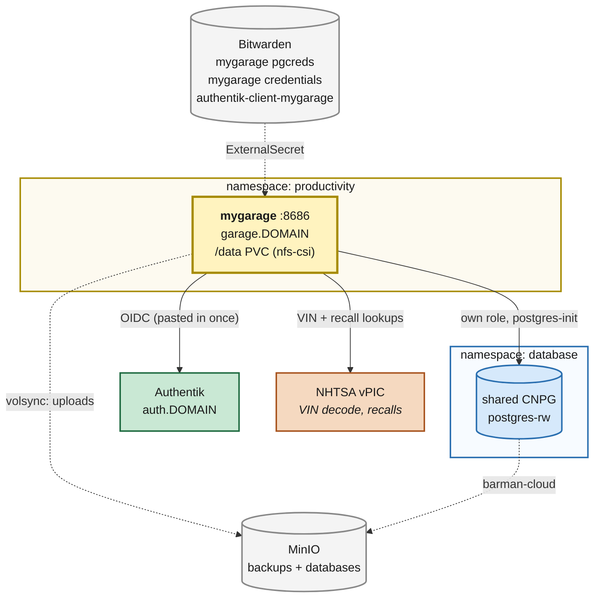

# MyGarage (vehicle maintenance)

**Date:** 2026-09-16
**References:** <https://github.com/homelabforge/mygarage> ·
<https://github.com/homelabforge/mygarage/wiki>

---

## Context

Vehicle upkeep is the last household record still kept on paper and in receipts. Paperless
holds the scans, but a scan of an oil-change invoice does not know when the next one is due,
and nothing in the cluster tracks mileage, fuel economy, or a registration renewal date.

[MyGarage](https://github.com/homelabforge/mygarage) is the fit: a self-hosted vehicle
maintenance tracker with service visits, fuel and DEF fill-ups, date/mileage/engine-hour
reminders, tire tread and pressure history, parts on hand, and per-vehicle document storage.
It decodes a VIN against the NHTSA API, so setting up a vehicle is typing seventeen
characters rather than a spec sheet.

It lands in `productivity` next to `mealie`, `paperless`, `vikunja`, `wallos` — the household
record-keeping namespace. LubeLogger was the obvious alternative; MyGarage was chosen because
it speaks Postgres natively (so it joins the shared CNPG cluster rather than adding a datadir
to back up) and because its OIDC support verifies against a JWKS, which is the flow Authentik
already serves for five other apps here.

**Note on naming.** The upstream project moved from `sickkick/mygarage` to
`homelabforge/mygarage`; the old URL redirects. The image is
`ghcr.io/homelabforge/mygarage`.

## Current State

- **Postgres**: one shared CNPG cluster at `postgres-rw.database.svc.cluster.local.`; apps get
  a database and an unprivileged role reconciled on every start by a `postgres-init`
  initContainer reading a Bitwarden-held credential (`vikunja`, `paperless`, `forgejo`).
- **Storage**: dynamic `nfs-csi` for ordinary app data on the NAS; `openebs-hostpath` for
  node-local scratch.
- **Backups**: `kubernetes/components/volsync` (restic → MinIO `backups`) per PVC, hourly;
  barman-cloud → MinIO `databases` for CNPG.
- **SSO**: `terraform/authentik/application_<app>.tf` + the `oidc_creds` module, which mints
  the client pair and stores it in Bitwarden as `authentik-client-<app>`.
- **No SMTP anywhere in this cluster.**
- **Ingress**: `className: internal`, `wildcard-cert-tls`, with a `guarded` Gatus endpoint pair
  (one checks the app answers 200, one checks the name does *not* resolve externally).

## Target State

## Files Summary

| File | Purpose |
| --- | --- |
| `kubernetes/apps/productivity/mygarage/ks.yaml` | Flux Kustomization; volsync on `mygarage-data` |
| `…/mygarage/app/externalsecret.yaml` | pg role + assembled `MYGARAGE_DATABASE_URL`; pinned `MYGARAGE_SECRET_KEY` |
| `…/mygarage/app/helmrelease.yaml` | app-template; `postgres-init` + `ghcr.io/homelabforge/mygarage` |
| `…/mygarage/app/kustomization.yaml` | wires the above + the guarded gatus template |
| `kubernetes/apps/productivity/kustomization.yaml` | adds `./mygarage/ks.yaml` |
| `terraform/authentik/application_mygarage.tf` | OIDC provider + application + policy binding |
| `terraform/bitwarden/main.tf` | `mygarage pgcreds` and `mygarage credentials` items |

## Key Design Decisions

**D1 — Postgres on the shared cluster, not the SQLite default.**
MyGarage ships with `sqlite+aiosqlite:////data/mygarage.db` and upstream calls Postgres the
recommendation for multi-user instances. Here the deciding argument is the backup path, not
concurrency: a SQLite file on an NFS claim gets copied by restic while the app holds it open,
which is crash-consistent at best, and SQLite over NFS has a long history of lock trouble
besides. On the shared CNPG cluster the records instead ride barman-cloud → MinIO with proper
WAL archiving, and the NFS claim is reduced to blobs that do not need a consistent snapshot.
Cost: one more role on the shared cluster, and a `postgres-init` initContainer.

**D2 — `MYGARAGE_SECRET_KEY` is pinned from Bitwarden rather than auto-generated.**
Left unset, the app mints a key on first boot into `/data/secret.key`. That key does double
duty: it signs session JWTs *and* encrypts the settings rows the app marks `encrypted` — which
includes the OIDC client secret. Those two things then live on opposite sides of the split D1
just created: the encrypted settings in Postgres, the key that decrypts them on the NFS claim,
backed up by two independent paths with no coordination. Restore one without the other and the
SSO config is unrecoverable. Pinning the key in Bitwarden (`mygarage credentials`, custom
field `secret_key`, the same shape as Vikunja's `service_secret`) decouples them. It is
write-once: rotating it logs everyone out and orphans every encrypted setting.

**D3 — OIDC is configured in the app's UI, once, by hand.**
This is the one step that is not code, and it is deliberate. `.env.example` upstream still
documents `MYGARAGE_OIDC_CLIENT_ID` / `_SECRET` / `_DISCOVERY_URL`, but as of 3.4.0 **nothing
in the backend reads them** — `grep -rn MYGARAGE_OIDC backend/app` finds only the seeded
database defaults in `settings_init.py`. OIDC issuer, client id and client secret are database
settings edited under Settings → System, with the secret encrypted at rest (hence D2). There
is no env-var or config-file path to declare them.

So the Authentik half stays fully in code — `application_mygarage.tf` creates the provider,
the application and the policy binding, and the `oidc_creds` module writes the pair into
Bitwarden as `authentik-client-mygarage` — and the owner pastes that pair into MyGarage once.
This is squarely the "steps that only ever happen once or twice" case in `CLAUDE.md`: building
a controller or a seeding Job to write two rows into the app's own settings table would be
more machinery than the thing it automates. If upstream adds env-var support, this becomes an
ExternalSecret and the manual step goes away.

**D4 — `SCHEDULER_ENABLED: "true"` is not optional.**
`register_jobs()` returns early unless that variable is exactly `"true"`, and it gates every
background job: reminder due-date evaluation, the weekly NHTSA recall check, DEF level checks,
telemetry pruning. Without it the app looks completely healthy and silently never tells anyone
an oil change is due — which is the entire reason it is being deployed. It is set in the
HelmRelease with a comment saying so.

**D5 — `MYGARAGE_TRUSTED_HOSTS` must name the Authentik host.**
MyGarage fetches the OIDC discovery document and the JWKS server-side through an SSRF guard
that refuses private address space unless the host is explicitly trusted. Authentik answers on
the internal load-balancer range, so without `MYGARAGE_TRUSTED_HOSTS: auth.${SECRET_DOMAIN}`
the issuer URL is rejected at save time and the callback later fails on the JWKS fetch. This
is the usual shape of the self-hosted-IdP-behind-an-SSRF-filter problem; the guard is doing
its job, and the host is named rather than the filter disabled.

**D6 — Authentik must sign with RS256.**
MyGarage verifies the id_token with `joserfc` against the provider's JWKS and accepts only
`EdDSA` and `RS256`. Authentik's default is an unsigned provider that issues HS256, which has
no JWKS entry at all, so the callback fails. `signing_key` is set to the default signing
keypair — the same fix Vikunja, BookStack and Open WebUI needed.

**D7 — `enableServiceLinks: false`.**
The app reads its settings with `env_prefix="MYGARAGE_"`, so a Service named `mygarage` makes
the kubelet's Docker-link compatibility variable `MYGARAGE_PORT=tcp://<clusterIP>:8686` collide
exactly with the integer `port` field. Upstream defends against this (issue #102) by ignoring a
non-integer value and warning, so this is belt-and-braces rather than a fix — but there is no
reason to hand the app a variable it has to work around, and the pod needs no service links.

**D8 — Single replica, `Recreate`, RWO.**
The container runs Granian with `--workers 1` because APScheduler needs single-process mode,
and the `/data` claim has one writer. Two replicas would double-fire every scheduled job. This
is the house default anyway (see the home-lab section of `CLAUDE.md`); noted only because the
app *has* a scheduler, which is the usual reason a second replica goes wrong quietly.

## Owner Steps

These cannot be done from the repo — they need secrets, or an interactive session.

1. **Apply `terraform/bitwarden`** to create:
   - `mygarage pgcreds` — login item; MyGarage's Postgres role.
   - `mygarage credentials` — custom field `secret_key`. Write-once (D2).
2. **Apply `terraform/authentik`** to create the provider, application and binding. The
   `oidc_creds` module writes `authentik-client-mygarage` into Bitwarden itself.
3. **Merge and let Flux reconcile.** The app comes up in its default `auth_mode: none` — it is
   reachable on the internal network with no login at all until step 4. Do not add an external
   DNS record before then; the guarded Gatus endpoint checks exactly that.
4. **Turn on SSO in the app** (Settings → System → Security). This is D3, and the one manual
   step:
   - Provider Name: `Authentik`
   - Issuer URL: `https://auth.${SECRET_DOMAIN}/application/o/mygarage-provider/`
   - Client ID / Client Secret: the username / password of the Bitwarden item
     `authentik-client-mygarage`.
   - Leave **Redirect URI** empty so the app generates
     `https://garage.${SECRET_DOMAIN}/api/auth/oidc/callback`, which is the strict entry
     registered in `application_mygarage.tf`. Typing it by hand risks a trailing-slash mismatch.
   - Scopes: `openid profile email` (the default; the email claim is required).
   - Then set **auth_mode** to `oidc` and sign out.
5. **First sign-in becomes the admin** (`create_or_update_user_from_oidc` grants admin when the user table is empty). Sign in
   as the household owner before anyone else does.
6. **Add the vehicles**: VIN decode fills in make/model/trim from NHTSA; then set the current
   odometer so mileage-based reminders have a baseline.

## Verification

- `flate test all -p kubernetes/flux/config` passes (this is what CI runs).
- After reconcile: `cluster-apps-mygarage` Ready; the `mygarage` Deployment Available; the
  `init-db` initContainer exits 0 and `\l` on the shared cluster shows a `mygarage` database.
- Pod logs show `✓ Secret key loaded from MYGARAGE_SECRET_KEY environment variable` — if they
  say `/data/secret.key` or `temporary in-memory key` instead, D2 did not take effect.
- Pod logs show `Scheduler enabled — starting background jobs.` — the warning
  `Scheduler disabled (SCHEDULER_ENABLED != 'true')` means D4 regressed.
- `https://garage.${SECRET_DOMAIN}` serves the dashboard; Gatus shows both endpoints green
  (app 200, name not resolvable externally).
- After step 4, signing out and back in round-trips through Authentik and lands logged in.
- After the first hourly tick, `mygarage` has a snapshot in the restic repo under
  `volsync/mygarage`.

## Risks

- **`auth_mode: none` is the default, and it is a real window.** Between step 3 and step 4 the
  app is open to anything on the internal network. It is not externally reachable — `internal`
  ingress class, no external DNS, and the guarded Gatus check watching for exactly that — but
  do not leave the window open longer than one sitting.
- **OCR is advertised but the runtime is not in the image.** `pytesseract` is a dependency
  while the image's apt layer installs only `curl`, `libmagic1t64`, `file` and
  `postgresql-client` — no `tesseract-ocr`. Document upload and storage work; the OCR text
  extraction on them probably does not. Not worth working around: Paperless is the OCR tool in
  this house, and a vehicle document can live there and be linked from here.
- **The upstream project is young and moves fast** (3.4.0 shipped 2026-09-15, one day before
  this doc). Read the CHANGELOG's "Upgrade note" before letting Renovate take a minor bump —
  3.4.0's adds a column to `tires`, and migrations run inside the app's own startup. The
  maintenance-mode flag (`MYGARAGE_MAINTENANCE_MODE`) exists for upgrades that need the
  migrations applied before any new data lands; it is not set here, and would be set by hand
  for one reconcile if a release ever calls for it.
- **`/data` and Postgres must be restored together.** D2 removes the worst of the coupling (the
  encryption key is in Bitwarden, not on the claim), but an attachment row in Postgres still
  points at a file on the claim. Restoring one from a much older snapshot than the other gives
  broken links, not an error.
